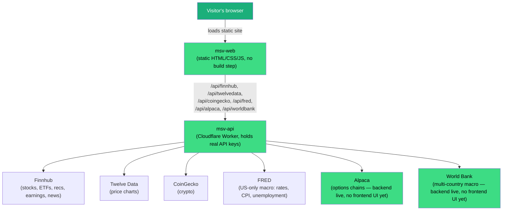
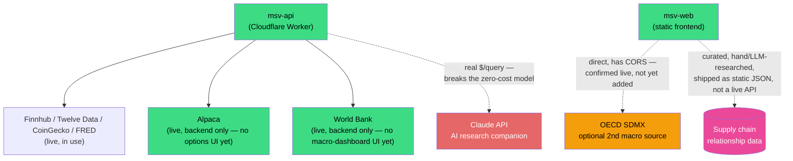

# $MSV Roadmap

## The vision, in plain language

$MSV started as "look up a stock and understand it" (single-ticker
deep-dive, plain-English tooltips). The long-term direction is bigger:
a **research and education tool** that shows not just what a company's
numbers are, but *how it fits into the world* — who it depends on to
operate, who depends on it, and what's happening in the broader economy
that will push its price around next. The mental model: today the app
answers "what is this stock's P/E ratio and what does that mean?" —
the goal is for it to also answer "why does an interest rate hike matter
to this specific company, three steps removed?"

This document is the living plan for getting there. It's meant to be
read start-to-finish by someone new to the project, and updated as
priorities change — see [HISTORY.md](HISTORY.md) for how we got to this
point, and [TODO.md](TODO.md) for the concrete next actions.

## Current architecture (as of 2026-09-21)

Two repos, both under the `Maximising-Shareholder-Value` GitHub org:
**msv-web** (this repo, the frontend) and
**[msv-api](https://github.com/Maximising-Shareholder-Value/msv-api)**
(the backend proxy — keeps real API keys server-side). Everything today
is **zero marginal cost** — every data source is a free tier, and the
only thing that scales with visitors is how close you get to those free
rate limits. Alpaca and World Bank were added 2026-09-21 (see
[HISTORY.md](HISTORY.md) Phase 9) — both proxy routes are live and
tested against real data, but nothing on the frontend calls them yet.

## Where the roadmap items plug in

Green = live today. Orange = a candidate new data source, same zero-cost
model, not yet added. Pink = not a live API at all — curated content
that ships as data files. Red = the one piece that genuinely costs real
money per use and needs a cost decision before it's built, not just an
engineering decision.

## The pillars (what "the vision" breaks down into)

| # | Pillar | What it means concretely |
|---|---|---|
| 1 | **Multi-asset-class indicators** | Bonds, options, commodities, crypto, ETFs, index funds each get real indicators suited to *that* asset type, instead of inheriting stock-shaped sections that show N/A. Extends the existing `getInstrumentType()` / `applyInstrumentTypeUI()` pattern already used for stock/ETF/crypto. |
| 2 | **Supply chain visualization** | A visual map of a company's upstream suppliers and downstream buyers — e.g. an AI data center operator depends on turbine manufacturers and transformer makers, who depend on electrical-grid suppliers and rare-earth/raw-material miners. No free live API provides this; it has to be curated per company/theme. |
| 3 | **Education layer tied to the supply chain maps** | Plain-English explanations of *why* those dependencies exist — not just "here's the chart," but "here's why this matters and how to think about it." Bundled with #2, not separable from it. |
| 4 | **Macro/political dashboard, multi-country** | Select or compare countries: elections, bills, monetary policy, rate cycles, "what this means for the average person." Today's Macro tab is US-only (FRED). World Bank and OECD both offer genuinely free, no-API-key, multi-country data — see [API_RESEARCH.md](API_RESEARCH.md). |
| 5 | **General "explain the concept" layer** | E.g. "what does a Fed rate hike mean, split by category, for the average person" — for someone learning markets from scratch. Can mostly reuse the existing rule-based pattern in `analysis.js` (fixed thresholds → plain-English text) that already powers the Outlook section. |
| 6 | **Embedded AI research companion** | A chat-style research assistant inside the app, modeled on how Jozsua already researches trades in Claude conversations (see the two conversations referenced when this was scoped, 2026-09-19). The only pillar that requires a live LLM API and breaks the current zero-cost architecture — needs a validation step and a cost model before committing to the full build. |

## Recommended sequence

This came out of a structured impact/effort pass (impact = how much
difference it makes if done well; effort = time/complexity, including
data-sourcing and curation work, not just code):

1. **Pillar 1 — multi-asset-class indicators.** High impact, low effort:
   reuses existing architecture and API keys you already have, fixes a
   visibly broken thing (N/A everywhere), zero new cost. **Do this
   first.** — **Status: mostly done.** A live audit (2026-09-19) found
   ETFs/commodities/crypto already render clean. Options data is now
   live on the backend (Alpaca, 2026-09-21); the options UI on
   msv-web is the one piece still open. See [TODO.md](TODO.md).
2. **Pillar 5 — explain-the-concept layer.** High impact, low-to-medium
   effort: mostly writing, reusing the existing Outlook pattern. This is
   the connective tissue that makes every later data-heavy feature
   (supply chains, macro) actually land for a beginner instead of just
   showing more numbers.
3. **Pillars 2+3 — supply chain visualization + education, as a pilot.**
   High impact, high effort: start with **one theme** (AI infrastructure
   — already Jozsua's own recurring research interest) and ~5-10
   companies, hand-curated. Prove the format earns its curation cost
   before expanding to more themes.
4. **Pillar 4 — multi-country macro.** Medium impact, high effort: same
   *kind* of work as the US Macro tab, at higher effort (new data
   sources, comparison UI). Do after the education layer exists, so the
   numbers this tab shows aren't just numbers. — **Status: backend
   done.** World Bank proxy is live (2026-09-21, no key needed). The
   country-selectable dashboard UI on msv-web is still unbuilt.
5. **Pillar 6 — AI research companion.** High impact, but impact is
   **uncertain** and effort is high, plus it's the only pillar with a
   real ongoing dollar cost. Validate cheaply first — e.g. ship a few
   *static* curated research threads (in the same spirit as the two
   conversations that inspired this) before wiring up live LLM calls with
   a real per-query cost and a decision about who pays for it as usage
   grows.

Nothing here is dropped — pillar 6 specifically is "not yet," not
"never." Revisit once pillars 1-5 give the app enough of its own
structured data that an AI companion has something real to reason over.

## Design principle worth protecting

Everything in $MSV today runs on free tiers and costs nothing to operate
regardless of how many people use it (rate limits aside). Pillars 1-5 all
preserve that. Pillar 6 is the one exception, and should be treated as a
deliberate, explicit decision to leave that model — not something that
creeps in accidentally (e.g. via one "quick" LLM-powered feature added
without thinking about what happens at 100 simultaneous users).

## Placeholder-data decision (home page, 2026-09-19)

The world map and ticker sidebar strip (`MARKET_TICKERS` in `home.js`)
used to fire 20 live Finnhub quote calls on **every single home page
visit**, unconditionally — the single biggest fixed per-visit API cost
in the app. As the home page gets more visually complete (more detail,
a "how to use" section), that fixed cost was worth removing: those
sections now show clearly-labeled placeholder data instead of live
quotes. Winners/Losers/Most Active/Crypto/Macro tabs are untouched —
they're already lazy (only fetch when a visitor actually clicks that
tab), so they don't carry the same "cost on every visit" problem.
**Reverse this** (wire the map/strip back to live data) once either:
real visitor traffic justifies the API cost, or a paid/higher-limit tier
is in place for one of the underlying data sources.
